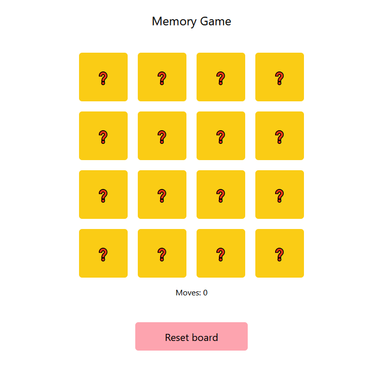

# Memory game

This memory game was created with Vite+React.

## Live

<a href = 'https://memory-react-lilunia.netlify.app/'>https://memory-react-lilunia.netlify.app/</a>

## Technologies

## About the project

The memory game is about finding matching pairs of cards. The user selects two cards by clicking on them. If the two cards are identical, they are revealed; if not, they are hidden and the user selects two cards again. When all pairs have been matched, the game ends. During the game, the player's moves are also counted (each selection of any two cards is counted as a move).

## Screenshot

  

  
  

